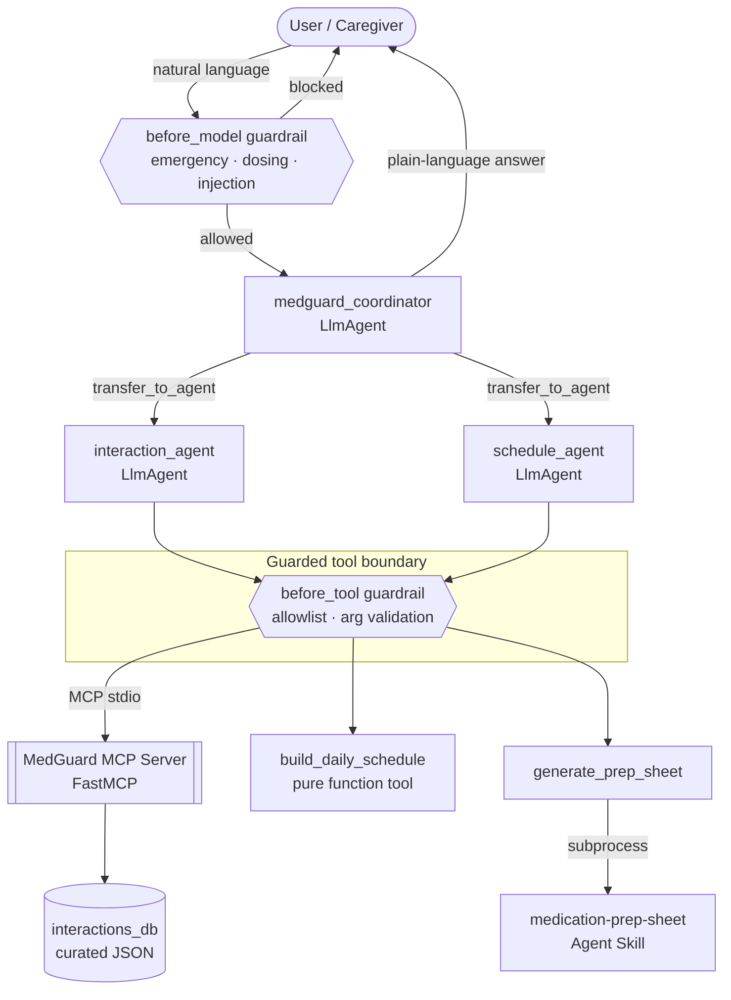
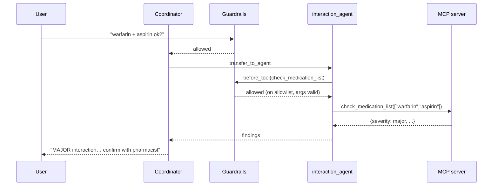

# MedGuard — Architecture

## System overview

## Why multi-agent (Day 2)
A single monolithic prompt tends to blur responsibilities. MedGuard splits work
into a **coordinator** plus two **specialists** so each has a small, testable
instruction spec and a narrow tool set:

| Agent | Responsibility | Tools |
|-------|----------------|-------|
| `medguard_coordinator` | Owns the conversation, delegates, keeps disclaimers visible | (transfer only) |
| `interaction_agent` | Known-interaction lookups | MCP: `check_drug_pair`, `check_medication_list`, `lookup_drug`, `list_known_drugs` |
| `schedule_agent` | Daily schedule + printable sheet | `build_daily_schedule`, `generate_prep_sheet` (skill) |

## The MCP boundary (Day 2 & Day 5)
The drug knowledge lives behind a standalone **MCP server** (`mcp_server/`),
consumed by the agent through ADK's `McpToolset` over **stdio**. Because it is a
standard MCP interface, the same server could be reused by another framework or a
coding agent with no changes. The server is a thin wrapper over
`interactions_db.py`, which is pure, cached, and unit-tested.

## Agent Skill (Day 3)
`skills/medication-prep-sheet/` follows the open Skill layout with
**progressive disclosure**: only `name` + `description` sit in context; the body
loads on trigger; `scripts/build_prep_sheet.py` runs out-of-band so its output
never bloats the token window. It is bridged into the agent as the
`generate_prep_sheet` tool (skill + tool composition).

## Security (Day 4) — zero-trust guardrails
Deterministic callbacks make the safety decisions, not the model:

* **`before_model_callback`** screens user input: emergencies route to human help,
  dosing/diagnosis requests are refused, prompt-injection is neutralised.
* **`before_tool_callback`** enforces a **default-deny allowlist** and validates
  every tool argument (size + injection scan).
* **Least privilege**: `tool_filter` limits the MCP tools the agent can see; the
  MCP server opens no network port (stdio only); the prep-sheet script runs in a
  subprocess.
* **Privacy by design** (Concierge track): only a short, non-identifying label is
  collected — never full names or IDs.

## Deployability (Day 5)
`Dockerfile` builds a Cloud Run-compatible image serving `adk api_server`. The
MCP server ships in the same image and is launched as a subprocess, so there is
no second public endpoint to secure.

## Request lifecycle (happy path)

